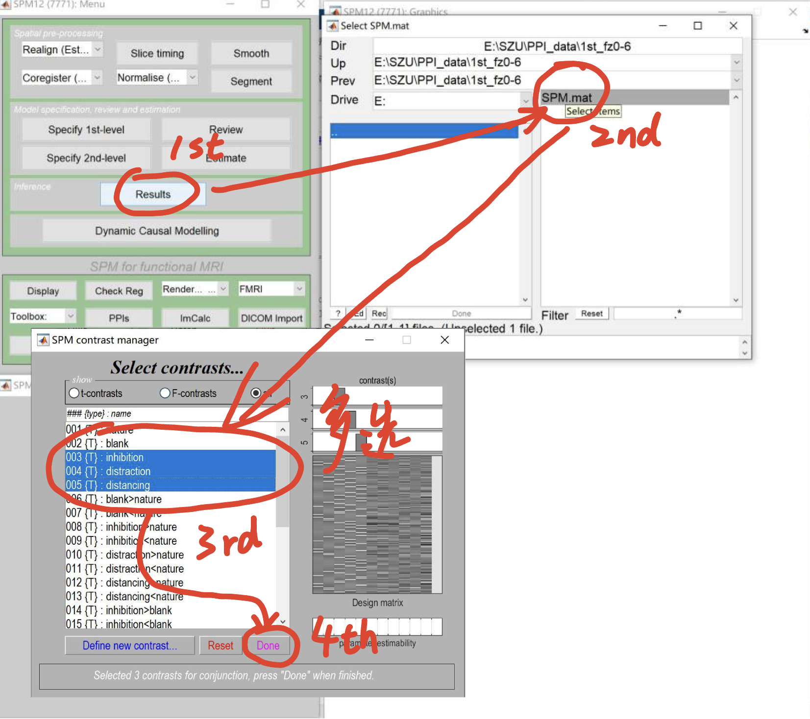
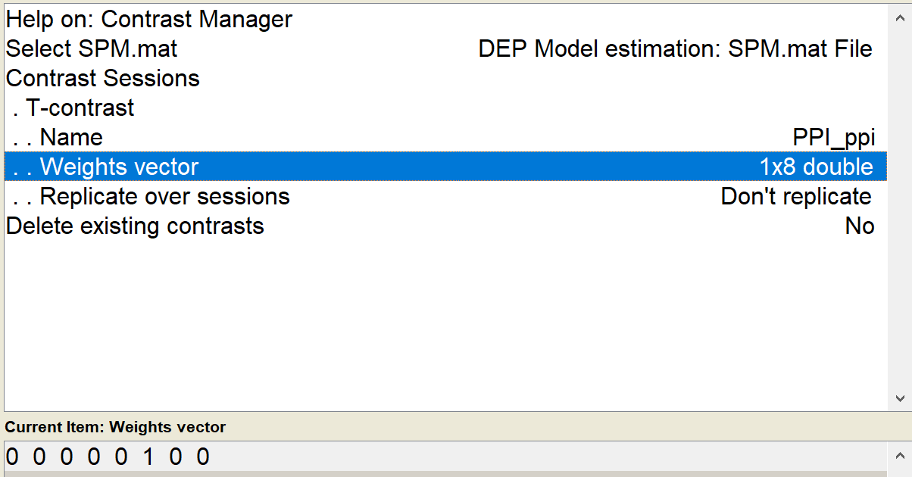

# 总概

<font size=4>心理生理交互分析（PsychoPhysiological Interactions，PPI）是一种用于分析任务态功能性磁共振成像（fMRI）数据的方法。它主要用于研究任务条件如何影响不同脑区之间的功能连接强度</font>。

<font size=4>PPI分析的基本成分：</font>

1.  <font size=4>**心理项**：代表实验任务的时间序列。</font>
2.  <font size=4>**生理项**：感兴趣脑区的时间序列。</font>
3.  <font size=4>**交互项**：心理项和生理项的乘积。</font>

<font size=4>通过分析这三个项之间的关系，PPI可以揭示在不同任务条件下，脑区之间的功能连接是否发生变化。</font>

<font size=4>PPI分析在SPM（Statistical Parametric Mapping）软件中有详细的实现步骤，可以帮助研究者进行任务态fMRI数据的功能连接分析。</font>

# 具体步骤

<font size=4>PPI分析的步骤包括：</font>

1.  <font size=4>**选择感兴趣的脑区（VOI）**：提取该区域的时间序列。</font>
2.  <font size=4>**生成PPI变量文件**：提取任务序列和交互项文件。</font>
3.  <font size=4>**构建回归模型**：心理项、生理项和交互项进行回归。</font>
4.  <font size=4>**统计分析**：评估交互项的显著性，以确定任务条件是否影响脑区之间的连接。</font>

<font size=4>其中，想要生成PPI变量文件，需要我们使用一阶处理后生成的`SPM,mat`文件，二阶组水平上的`SPM.mat`文件由于缺少`sess`字段，不能够直接用于从零开始的PPI分析。所以之后的步骤我们**以fz条件下0-6秒的单个被试的一阶`SPM.mat`为基础**，进行一次PPI分析的流程（如图1）。</font>

{width="350"}

<p>

## 选取VOI

<font size=4>在我们完成一阶处理后，得到了个体水平上、不同condition的对比，这些对比写在了一阶生成的`SPM.mat`中，而选取VOI种子点就需要在这个基础上进行。这个过程我们可以想象是把原料（咖啡豆磨粉）放入加热壶得到加工产物（咖啡液体）的过程，咖啡豆磨粉是一阶`SPM.mat`、半成品咖啡液体是得到的`VOI_*.mat`。</font>

<font size=4>首先在spm界面我们选择`result`进入结果查看，导入被试1_fz0-6_1st的文件，这里我们多项选择`inhibition`、`distraction`、`distance`仨condition，然后选择“done”（如图2）。</font>

{width="400"}

<p>

<font size=4>在之后的结果校正选项中，我们进行如下选择：`conj'n`、应用mask上我们选择`none`、多重比较校正选择`FWE`（p值设定为0.05）、阈值体素（`Extend Threshold Voxel`）设定为`10`（见图3）。进行好以上设定后得到统计参数图。</font>

{width="380"}

<p>

<font size=4>得到参数统计图后，我们仅仅是得到坐标，但是为了确定图中信号增强确切来说是哪个脑区，我们需要使用`AAL3`内置的MNI模板对坐标来打标签（如图4）。</font>

{width="400"}

<p>

<font size=4>打完标签后很明显，我们可以从参数统计图看到左右颞叶处存在两大块bold信号。我们假设要选取右边那个Temp_Sup_R作为VOI，那么首先我们可以点击一下感兴趣区域在列表左边的坐标系数，之后点击`eigenvariate`来尝试生成VOI，之后按照程序给出的参数进行填写（如文件名、VOI的形状、半径等等）。和之前在预处理中的生成文件一样，这里spm会在你的文件命名之前自动加上一个`VOI_*`前缀。</font>

{width="355"}

<p>

<font size=4>设置完毕后，我们将在原一阶`SPM.mat`路径处得到一个`VOI_*.mat`文件，这是Temp_Sup_R处Bold信号的时间序列。至此，我们拿到了“原料”之一--**生理项**素材。生理项代表的是特定脑区的BOLD信号变化。</font>

## 生成PPI变量文件

<font size=4>进行PPI分析需要我们准备好**生理项**、**心理项**和**交互项**，其中在之前的步骤中我们已经准备好了生理项的文件载体，即右侧颞上回的种子点文件`VOI_Temp_Sup_R.mat`，而在这一部分的操作中，我们将生成**心理项**和**交互项**的文件载体--PPI变量文件。</font>

<font size=4>通俗来理解的话，我们可以想象这一个步骤是将牛奶和咖啡倒入机器制作卡布奇诺的过程，而这里的牛奶和咖啡可以对应我们一阶`SPM.mat`和刚刚生成的`VOI_*.mat`文件。</font>

<font size=4>在这一步骤中，我们可以直接从spm的主界面进入有关操作。我们可以直接在主界面点击`PPIs`选项，之后会直接蹦出对话框提示我们选择采用需要的一阶`SPM.mat`，这时候我们再选中之前说的fz条件下0-6秒的单个被试的一阶`SPM.mat`（见图6）。</font>

{width="430"}

<p>

<font size=4>选中后，程序会询问我们要进行**心理生理交互（`psycho-physiological interaction`）分析**还是生理生理交互分析，在选择`psycho-physiological interaction`之后，程序紧接着会弹出另一对话框提示我们选择对应的`VOI_*.mat`文件。刚刚我们说过，我们这次假定感兴趣的种子点是右侧颞上回，因而我们这里要选择的种子点文件便是在上一步生成的`VOI_Temp_Sup_R.mat`（如图7）。</font>

{width="360"}

<p>

<font size=4>这之后，程序会需要我们选择纳入的conditon和其在多元线性回归中的权重，这取决于我们之后的数据分析需求和实验设计以及研究目的，此处我们仅仅针对操作的流程，假定我们想要比较`3strategies > nature`这个condition，那么其中我们可以这样设置权重：</font>

-   <font size=3>将三种策略`inhibition`、`distraction`、`distance`的权重分别设置为**1**</font>

-   <font size=3>`nature`的权重设置为**-3**</font>

-   <font size=3>`blank`我们选择**不纳入回归方程**。</font>

<font size=4>注意，该参数之后再具体工作中的设置需要根据教授的要求**具体情况具体修改**。最后程序会让我们设置PPI变量文件的名称，这里我们假如输入“TemSupR_3vsNature”，程序也是会自动加上一个`PPI_*`前缀，因而我们最后得到的文件是`PPI_TemSupR_3vsNature.mat`。设置好后自动返回给我们一张结果图片。这里按照笔者标示，表（1）是VOI生理项Bold信号的时间序列；表（2）是心理项的信号时间序列；表（3）是心理生理交互项的信号事件序列（见图8）。之后，再`VOI_Temp_Sup_R.mat`的所在路径我们得到了**心理项**和**交互项**以及**生理项**的文件载体`PPI_TemSupR_3vsNature.mat`。</font>

{width="420"}

<p>

## 构建回归模型的准备工作

<font size=4>在之前的步骤中，我们知道PPI分析是将心理项、生理项、和交互项对目标脑区Blod信号时间序列来一个多元线性回归。而现在我们已经得到了VOI文件和PPI文件（即`VOI_Temp_Sup_R.mat`和`PPI_TempSupR_3vsNature.mat`）是不是就可以在回个归了呢。并不，我们之前总是比如说`PPI_TempSupR_3vsNature.mat`是心理项、生理项和交互项的**文件载体**云云。也就是说，我们想要对不同的项目来回个归还需要把其对应的值从文件中提取出来。这部分就是将心理项、生理项以及交互项的`value`从文件中取出来。</font>

<font size=4>在这个步骤，我们可以首先创建一个`n*3`的Excel表格，其中n为你实际分析的图片数量或者说frame数量。而这三列依次可以是**PPI交互项**、**VOI的Blod信号**（生理项）、**心理任务向量**（心理项）：</font>

| 序号 | PPI交互项 | VOI生理项 | 心理项 |
|------|-----------|-----------|--------|
| 1    | 数据      | 数据      | 数据   |
| 2    | 数据      | 数据      | 数据   |
| .... | ....      | ....      | ....   |
| n    | 数据      | 数据      | 数据   |

<p>

<font size=4>做成之后，我们接着就需要把实际的各项数据从载体文件中提取出来，复制粘贴进我们的整理表格了。这里假如我们首先去找生理项的数据。我们在MATLAB中打开对应的文件工作路径，加载VOI对应的mat文件：`load('PPI_TempSupR_3vsNature.mat')`，之后我们可以在工作区中看到该文件中有一个名为`PPI`的变量，我们查阅这个变量其中又包含`Y`、`P`和`ppi`这仨变量表格，它仨分别对应了生理项、任务项和交互项的值，把这仨变量表格里的数值复制粘贴到我们的Excel表格里备用就可以了。</font>

{width="550"}

<p>

<font size=4>当然其实我们也可以使用简单的代码命令来做：</font>

```         
% 加载PPI.mat文件
load('PPI_TempSupR_3vsNature.mat');

% 提取心理任务向量
Psych_variable = PPI.P;

% 提取PPI交互项
PPI_interaction = PPI.ppi;

% 提取从VOI提取的BOLD信号
V2_BOLD = PPI.Y;
```

<p>

## 构建回归模型

<font size=4>在前文中我们提到过，PPI分析可以被看作多元线性模型在fMRI数据中的应用，那么既然是回归，我们便需要再次定义一般线性模型。而在spm的`model specification`模块中，便对应了我们需要把心理项、生理项和交互项放进回归方程里。这里的操作如果从0开始做的话整个流程和我们之前在培训时的数据一阶处理内容很像，这里其实我们可以直接将当时一阶的对应条件batch拿来改一改再用。</font>

<font size=4>我们可以加载出之前fz0-6用的一阶batch，其他的条件和参数没有特殊要求可以不改，这里PPI分析只是在`model specification`中添加心理项、生理项、交互项这三者的回归（如图10），每个变量的名字`name`可以根据需要更改，对应的`value`就是刚刚我们在`PPI_TempSupR_3vsNature.mat`里往Excel表格里复制粘贴的那些值，这里对应填写上即可。</font>

{width="420"}

<p>

<font size=4></font>

<font size=4>改装完一阶batch的`model specification`后，我们还要去将其的`contrast manager`进行一定的小修改，具体而言就是添加一个新的t对比（t-contrast）。但是如果我们想要去查看脑区之间的连接，我们则需要添加交互项的对比项目，其重要意义如下：</font>

-   `PPI.ppi`：显示了在不同任务条件下，VOI与其他脑区之间的功能连接如何变化。

-   `PPI.P`：显示了任务条件对脑区活动的直接影响，但不涉及功能连接。

-   `PPI.Y`：显示了VOI的时间序列，但在交互项中不涉及任务条件的影响。

<font size=4>不过这里有个疑问需要解决，我本来的VOI就是在特定任务条件下选取的，怎么就这里说不涉及任务条件的影响了呢？这是因为尽管原始的时间序列虽然的确反映了某区域在整个试验期间的活动，但是在生成PPI文件的时候这个时间序列会经过去卷积和再卷积处理，以去除与任务时间的直接关系。因而说PPI的这个生理Bold和任务没关系。</font>

<font size=4>那么说到这里，我们继续进行最后一步的说明，即我们将PPI交互项加入`contrast manager`中。其实就是创建一个新的t-contrast，`name`就是写交互项比如“inter—PPI”、`weight vector`我因为之前定义回归模型的顺序是心理项、生理项和交互项，那么这里我的权重就是填`[0 0 0 0 0 0 0 1]`（如图11，前5个0对应我们原有的5个condition，后3个0对应我们的交互项、心理项和生理项）。</font>

{width="400"}

<p>

<font size=4>运行batch之后，我们得到了一个类似于一阶结果的`SPM.mat`同样我们使用spm主界面的`result`选项，查看交互项的对比，就可以观察哪些脑区的信号增强和我们VOI有所关联了。不够根据之前笔者观察，普通一阶结果和PPI结果在一些对比中会有信号显著性差异，经过询问ai得到以下，仅供参考：</font>

> 在普通一阶分析和PPI分析中，信号显著性的差异可能源于以下几个原因：
>
> 1.  分析目标不同
>
> 普通一阶分析：主要关注单个脑区在不同任务条件下的激活情况。它评估的是每个脑区在不同条件下的活动水平。
>
> PPI分析：关注的是脑区之间的功能连接变化，特别是感兴趣区域（VOI）与其他脑区之间的交互作用。它评估的是任务条件如何调节这些连接 。
>
> 2.  模型复杂度
>
> 普通一阶分析：模型相对简单，主要包含任务条件的回归因子。
>
> PPI分析：模型更复杂，包含了任务条件、VOI的时间序列以及它们的交互项。这种复杂性可能揭示出普通一阶分析中未能检测到的信号。

> 3.  信号来源
>
> 普通一阶分析：仅考虑单个脑区的活动。
>
> PPI分析：考虑了脑区之间的交互作用，可能揭示出由于这些交互作用而产生的显著信号。
>
> 4.  统计功效
>
> 普通一阶分析：可能由于统计功效不足，未能检测到某些脑区的显著信号。
>
> PPI分析：通过考虑交互作用，可能提高了检测某些脑区信号的统计功效。
