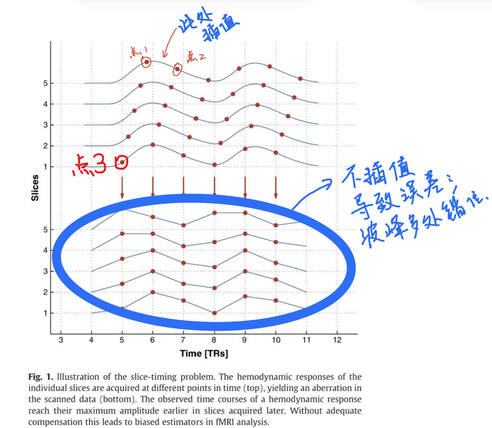
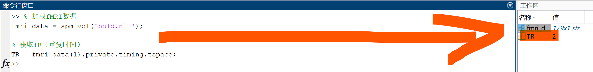

------------------------------------------------------------------------

# 导言

<font size=4> 这篇随笔针对许多有兴趣于fMRI但是受限于平台或机会对相关知识操作并不是那么accessible的心理学同窗们，包括我自己在写这篇东西的时候也是边学边写，这里也感谢深圳大学何振宏教授课题组能够让我有接触核磁数据处理的机会。fMRI的预处理包括了许多步骤，这些步骤可以在目录导航看到，此处不多赘述。通俗来说，这玩意有两种类型的图片或者影像：功能像和结构像。有普通心理学基础的各位都对fMRI有印象：让被试做任务或者干个什么事情，他脑子某个区域就激活，而这个激活的图像，就是由功能像图片告诉我们；可是这个激活准确而言是在哪里或者说哪个结构的位置，这就需要结构像为我们提供信息。而预处理打个不准确的比方，就好像用ai修复清代老照片（这个表述有些夸张），让我们本来的图像更加清晰，分析起来更加准确。就像很多新生初次学习SPSS一样，SPSS课程进度往往比心理统计快，所以容易造成初学者不知道自己操作的意义是什么，本篇随笔就是针对背景薄弱的同窗们学习SPM操作时，能够有个东西提示我们每个操作最基本的意义是什么，甚至每个必要参数的基本的意义是什么。 </font>

<font size=4> 本人知道，在目前信息发达的时代，很多人写的东西要比这篇随笔更强，但是在我学习有关概念的时候，我发现很多博客或者视频只是教授各位如何去操作，而很少涉及为什么要这样操作。我相信翻开这篇随笔的各位应该不满足于自己不知其所以然的样子。因此我决定将网络或各个来源的碎片化知识在这里进行一个粗糙的整合，若是能够发挥一丝作用，本人实属荣幸。本版本仅先针对事件相关设计的核磁处理（event-related design）其他类型取决于本人以后有没有学上 </font>

------------------------------------------------------------------------

# 所用工具

-   <font size=4> MATLAB--在硬盘里有备份。这个程序是真的大，说实话这个代码我完全不懂。</font>

-   <font size=4> SPM12--无论是[官网](https://www.fil.ion.ucl.ac.uk/spm/software/download/ "这个下载贼慢")还是对应的[Github](https://github.com/spm/spm12.git "这个下载速度倒还可以")都有下载，不过需要注意官网下载是真的慢。不过反正压缩包备份了。</font>

-   <font size=4> aal atlas, wfu pick atlas啥的，不过这几个我还没用，等后天用了再更。AAL可以从[AAL官网](https://www.gin.cnrs.fr/en/tools/aal/ "印象中网速不慢")下载；WFU也有[WFU官网](https://www.nitrc.org/projects/wfu_pickatlas "没用这个渠道，我用的是教授的个人分享文件")下载。</font>

-   <font size=4> 具体的基本软件安装、导入和打开插件请各位参考互联网上的教程，比如[这条视频](https://www.bilibili.com/video/BV19f4y1z71A/ "如何导入SPM")教了如何导入SPM、而[这条博客](https://blog.csdn.net/Ricoxx/article/details/132204699 "如何导入SPM和wfu-pickatlas")则教了如何导入SPM和wfu-pickatlas</font>

------------------------------------------------------------------------

# 练习用的dicom

<font size=4> 虽然教授给了我一个被试的数据用于练习，但是据说南加州大学的[网址](https://ida.loni.usc.edu/login.jsp "南加州大学影像与数据归档")也提供有影像数据供人学习，只是我死活注册不了,挂VPN全局也没用，不过也许你们换个浏览器就可以了。同样这里还有[博客](https://blog.csdn.net/Sherlily/article/details/133160557 "[数据集]fMRI数据集汇总")汇总了各个开放数据平台供有需要者下载学习。</font>

------------------------------------------------------------------------

# 1 dicom转nii

## 操作意义

### 个人对于转换的一些疑惑

<font size=4> 其实这一步思路很单纯，由于fMRI机子扫出来的影像格式（也就是dicom格式）没法直接被用作数据分析。而关于为什么不直接生成另外一种可用于数据分析的文件类型，我询问newbing得到这样的答案：</font>

> <font size=3 face="宋体"> *核磁共振成像设备（MRI）生成DICOM（Digital Imaging and Communications in Medicine）格式的数据，因为这是医学影像存储中的国际标准格式。DICOM格式不仅包含图像数据，还包含了患者信息、扫描参数和其他元数据，这些信息对于确保图像的正确解释和后续处理至关重要。*</font>
>
> <font size=3 face="宋体"> *DICOM格式的一个主要优点是它的通用性和兼容性。由于医学影像设备的多样性和复杂性，统一的数据格式可以确保不同设备和软件之间的兼容。这样，医生和技术人员可以使用各种工具和应用程序来查看和分析图像，而不必担心格式不兼容的问题。*</font>
>
> <font size=3 face="宋体"> *此外，DICOM格式支持详细的图像质量和结构信息，这对于医学诊断至关重要。例如，它可以存储关于图像如何获取的技术细节，这些细节可能会影响图像的解释。*</font>
>
> <font size=3 face="宋体"> *尽管DICOM格式非常强大，但它也可能比直接用于分析的数据格式更复杂。因此，通常需要专门的软件来读取DICOM文件，并将其转换为适合特定分析任务的格式，如NIFTI。这种转换允许研究人员使用更适合大规模图像处理和统计分析的工具和方法。*</font>
>
> <font size=3 face="宋体"> *总的来说，DICOM格式是医学影像领域的黄金标准，它确保了数据的完整性、安全性和互操作性，即使这意味着在进行分析之前需要额外的转换步骤。*</font>

<font size=4> 不管怎么说，为了下一步的数据处理，我们需要根据自己特定的目的将一般化格式的dicom数据转换为我们所需要的格式（即nii格式）。而之所以又采用了nii格式则是由于：**第一，这种格式能够在保留分析所需要的空间体素信息前提下，将其他信息简化，方便处理和共享；第二，这种类型的格式支持多种主要的科研软件，方便学者进行分析**。</font>

### 关于nii文件个人又补充的知识

<font size=4> 上一个部分我们已经提到了nii文件的便利，这里是我在后面的学习中又对nii格式一些概念的知识补充。<font color="red">**注意：这一小节的内容仅对于本文件的内容有些难以理解，建议各位如果在之后的环节遇到以下陌生概念再回来阅读：**</font></font>

-   <font size=4> **时间帧数/时间点数（frame）**</font>

-   <font size=4> **Session**</font>

#### **时间帧数/时间点数（frame）**

<font size=4> 首先我们先介绍一下**时间帧数（frame）**，也作时间点数这个概念，我们经常听到人说nii文件可以是三维的，也可以是四维的，这个怎么理解呢？这里假如我们有两个文件夹，甲文件夹里面是《月英无惨》这本漫画的32张图片；乙文件夹里面是《鬼父·上》和《鬼父·下》两部小电影。你会发现，虽然两个文件夹的内容都属于媒体文件，但是前者明显是二维的；而后者则属于三维的，nii文件也会有类似的现象。我们已经知道nii文件本就包含了人脑冠状面、矢状面以及水平面三个维度的图像，所以理解nii格式的三维属性应该不会困难，而四维则是nii会像电影将n张图片合在一起形成动态效果一样，将一段时间内所有的全脑图像何在一起，使自己也具有时间上的动态性。只不过区别在于，视频文件如果这样整合静态图像，文件后缀可能会由.png变成.mp4或者.avi；但是nii这么干它的文件后缀不会变而已。</font>

<font size=4> 那么再回到我们的问题，什么是frame也就是时间帧数呢？这里其实很多同窗看到“帧数”，心里应该能够有那么个意思了。顾名思义，视频文件里说的帧数就是一段时间内包含的静态图片的数量，而这里的frame也类似，不过得换换词儿：时间帧数是指在一段时间内，nii文件所包含的，被扫描的全脑（把帧数换成全脑）数量。那么，我们如何去判断自己拿到的图片由一个还是多个frame组成呢？首先一个最简单的方法就是假如单个被试让你去处理的功能像nii文件几百个，那这样一般单个nii都只有一个frame。另外一种方法则使用MATLAB代码实现（首先需要将软件工作路径调整到目标文件夹）：</font>

```         
V = spm_vol('文件名.nii'); % 加载NIfTI文件，并创建一个结构体变量“V”

disp(V.dim) % 显示变量“V”中存储的nii文件的维度信息
```

假输出结果长这样：

```         
    96    96    72 
```

<font size=4> 那这个文件就只有一个frame。</font>

<font size=4> 或者结果长这样：</font>

```         
错误使用 disp
输入参数太多。
```

<font size=4> 那就说明这个nii四维的，包含了多个frame。至于具体几个去把工作区刚刚生成的变量V点开，点开后的表格有几行就是nii含有几个frame</font>

<font size=4> 说完什么是frame了，也说完怎么确定我们单个nii有无多重frame了，下面我们需要说一下在batch中选择文件时，如果有单个nii多重frame我们如何去选中文件（如图1-1）。如果各位在这里看不懂其实没有关系，这里是如果之后诸位遇到了相关操作细节供诸位翻回来参考的。</font>

{width="350"}

<p>

<font size=4> 最后，这里引用一段newbing的说明，各位在这里看不太明白没有关系，这段表述是为了帮助各位、也是帮助我自己在之后学完翻回来当便签看的</font>

> <font size=3 face="宋体"> ***如果一个fMRI扫描有70个切片（nslice = 70），并且在10分钟内每20秒扫描一次大脑，那么这个扫描会有30个时间帧（时间点数 = 30，扫了30个头）。每个时间帧都包含了70个切片的数据。***</font>

#### **Session**

<font size=4> 正如我们刚刚所介绍的那样，假如nii是一个系列电影，frame就是这个视频文件中的一帧帧画面。那么，**Session**我们则可以理解为组成这部电影的篇章。举个例子：在上一小节的视频文件夹里，《鬼父·上》这部分的故事就是《鬼父》系列的一个Session。这个概念和frame明显不是一个层面的东西，一个是具体的画面帧数；一个是更宏观的作品剧情。</font>

<font size=4> 就像影视节目每个章节可能在不同的日子播出一样，一个被试（就是参与实验的人）可能在不同的日子里来实验室进行扫描，或者在一天内完成多个不同的任务，每个任务都会产生一个session。这些session就像是电视剧的不同章节，它们是独立的，但都属于同一个大的故事——也就是整个实验。</font>

<font size=4>在fMRI实验中，我们可能对被试在不同条件下的大脑活动感兴趣，比如在安静休息时、做数学题时、听音乐时等等。每种条件下的扫描就是一个session，它们帮助我们理解大脑在不同情境下是如何工作的。所以，简单来说，session就是指在一个实验中，被试在不同条件或不同时间点进行的一系列独立的扫描。</font>

<font size=4> 在何教授的数据文档中，其实教授是将两个Session（简单vs复杂）直接分为了俩文件夹分门别类处理。这样做的好处是核磁数据在预处理的的过程中会出现像有机化学压轴题一样的中间产物，本来这些中间产物就够乱了，如果不进行分门别类，那么真的就会很耗费精力去整理文件并且容易选中错误的输入文件。这里直接向各位展示如果俩Session真的在一个文件夹咋整（注：如果多个Session合在了一个nii文件中，就不用管这个了）：</font>

{width="350"}

<p>

## 操作步骤

<font size=4> 这一项处理其实是最简单省力的一步了，无非是设置文件来源和输出路径，整个过程如无特殊要求可以通过SPM本体的batch进行。</font>

<p>

{width="1600"}

<p>

1.<font size=4>首先在SPM点开dicom导入转换batch</font>

2.<font size=4>其次在弹出的batch界面中，“DICOM files”为我们目标文件输入路径、“Directory structure”则为我们转换后的nii文件的输出路径。这个过程和平时在电脑上导出pdf、自定义安装应用的操作差不多。不过值得注意的是，在左栏可以右击在弹出菜单里新建任务，也就是说这个batch可以一次性转换好几批来自不同路径的数据到不同的目标路径，很好。</font>

<font size=4>在batch中其他参数需要根据不同任务去按照要求调试，这里主要作为入门手册讲一下最一般的、不深不浅的原理，架构核磁处理的认知手脚架。 <font size=4 color="red" face="黑体">**该步骤后输出功能像为`s_*.nii`文件；功能像为`f_*.nii`**</font></font>

------------------------------------------------------------------------

# 2 AC-PC对齐 AC-PC Alignment（Reorient）

## 操作意义

<font size=4> 这项操作名字听起来很技术，实际上用大白话来说其实很好理解。我们知道，被试参与实验时是躺在核磁机子里的，而出于生活经验，如果躺着的时候头像直立时一样往前看，一来后脑勺硌得慌；二来对颈椎也是不小的负担。所以被试在躺下的时候同样会对头的角度做一些调整使自己能够自然舒适，有利于保持头部位置的稳定。但是就如一千个读者心中有一千个哈姆雷特，诸多的被试也都用对自己来说最舒服的姿势。那么问题来了，我们毕竟要进行n多个样本的比较，如果被试在影像上姿势都不一样，还何谈多个被试以组为单位的分析准确性呢。这就需要我们统一将被试的T1结构像进行对齐，使之在图像中在一个相对统一的位置，而这个位置正是大脑中线**前联合（AC，Anterior Commissure）**和中脑水管上端**后联合（PC，Posterior Commissure）**之间的水平位连线。</font>

<font size=4> 其次，参考[此篇博客](https://blog.csdn.net/yufei0413/article/details/105220142 "这篇博客讲了AC-PC对齐的原因")，由于我们进行三维的脑成像数据分析时，人可以通过视觉信息来直觉地知道哪个位置是哪里，但是程序并不长眼，所以我们需要像在高考立体几何建立坐标系一样，告诉程序那颗三维人脑的空间原点、xyz轴分别大致在什么地方，这里的AC-PC对齐线中点则正是我们给程序设置的立体定向脑图谱的空间原点。以此为空间原点建立的三位坐标系可以帮助我们对空间中不同的人脑数据进行分析，而这种以AC-PC对齐线为基准线的脑图谱则被称为标准脑图谱。</font>

<font size=4> 另外，还有一个原因在上一篇博客中提及，如果不进行前后联合对齐，之后图片分割处理环节程序将会报错。</font>

{width="1600"}

<p>

<font size=4>需要注意的一点是，该项分析仅针对T1结构像图片，之所以仅对T1功能像操作，通过[此篇博客](https://blog.csdn.net/SunWanqing/article/details/109593449 "SPM批量将功能项配准到结构像和MNI")我们其实可以知道，当我们对齐一张结构像之后，可以使用程序自动批量地将几百上千张功能像自动与已对齐的结构像匹配，我们无需再花费时间和精力跟海量图片one by one了。比如在何教授新方法的预处理btach中，**Coregister: Estimate/font**模块就是干这件事情的（将T1图像分割中间产物与头动处理后的功能像对齐），再比如许多常规操作中，**图像配准（coregister）**就是干的这个活，这个之后的内容有说。</font>


<p>

<font size=4> 现在我们知道了前后联合大致于水平面的对齐线这个原则，可问题是，如果把图像放大，你会发现前后联合都是有自身体积的，所以我们到底是两个部分的哪个位置向对面连线呢？这里可以通过参考图2-2来大致了解需要配准的位置。当然，更为精准的图2-3也是重要的学习资料。然而参考[此篇教程](https://blog.csdn.net/weixin_45252325/article/details/118670242 "医学图像预处理：MIPAV做脑smri前连合后联合（AC-PC）")，在nii文件中一般这些脑结构在1mm的分辨率下我们看不太清楚，即使是何教授也在培训视频中有“大概位置”的表述。但是我们依旧可以通过一些比较明显的形状与位置特征去定位目标结构，之后的环节会详细描述。</font>


## 实务操作

<font size=4> 尽管被叫做AC-PC对齐但是在实务中我们其实顺带做了的事情其实蛮多，这一步我也愿意认为是最耗费眼神儿的一步。因为我们不仅仅需要将AC-PC对齐线（AC-PC Line）弄到水平面，我们还得把被试的头调整到图像中央、将被试的中央裂与图像的冠状线、矢状线对齐，在这个步骤中我们同时还要保证影像的强度（Intensity）≥400。下面我们进行分步操作</font>

<font size=4> 当然，在进行操作之前，我们首先应该知道在spm中这项功能的打开方式（见图2-4）在打开相应的功能文件后，我们需要再选择需要调整的T1结构像图片，在此步骤中，这张需要打开的图片则是我们刚刚转完格式后的<font color="red"> **Ss打头的nii文件**</font>。</font>

{width="1600"}

<p>

<font size=4> 针对图片的操作文字不好表述，建议各位出门左转观看何教授培训视频（第一个视频自20分40秒开始看）。如果有同窗没有接触到此培训，本人个人于下载了一份数据录制了视频该操作，[此屏幕录制](https://www.bilibili.com/video/BV1Dn4y1Q7rw "操作的视频笔记")仅供各位参考。概括一下这一步骤细分就是一下的操作：</font>

-   <font size=4>调整结构像在图片中的位置</font>

-   <font size=4>将中央裂与冠状线、矢状线对齐</font>

-   <font size=4>AC-PC对齐线调整到水平面角度</font>

------------------------------------------------------------------------

# 3 时间层校正Slice Timing

## 操作意义

### 最好了解一下的概念

<font size=4> 个人认为要回答该操作的意义，首先需要给初学者来一个slice的名词解释。简单来说：</font>

> <font size=3 face="宋体"> ***“Slice”**指的是大脑的一层层切片图像。这些切片是通过在不同的平面上对大脑进行扫描得到的，可以是水平面、冠状面或矢状面。每个“slice”都代表大脑的一个特定区域的图像，通常用于观察大脑活动和结构。*</font>

<font size=4> 更通俗的讲，我们可以换个说法，初中的时候我们知道这句话：<u> “点连成线、线连城面、面挪成体”</u>。这里我们都见过大脑扫面是一个立体的东西，就是一片片的各个方向的切片（学名slice，复数加s）把这个立体的脑影像给建构出来的。所以当我们讲到slice，我们就想象，那玩意就像北京烤鸭切片，不同角度（x轴、y轴、z轴）的鸭肉片组成了我们的鸭子，就好理解了。每一张slice就像我们手机拍出来的普通平面照片，照片有多清晰我们都知道要看有多少多少像素点，同样的，每个slice也有基本的“像素”，不过这里我们将其称作“体素”：</font>

> <font size=3 face="宋体"> ***体素（Voxel）**是指三维空间中的一个像素，它是图像和体细胞成像中的基本单位。每个体素代表了大脑内部一个小立方体区域的信号强度，通常这个立方体的大小为1mm×1mm×1mm（**这个数字不固定哈**）。体素就像是构成大脑活动图像的小积木，每个体素都包含了关于大脑某个特定区域活动的信息。*</font>

### 所以为什么要做时间层处理

<font size=4> 首先我们可以参考[这篇文章](https://www.sciencedirect.com/science/article/pii/S1053811911007245 "fMRI中的时间层效应以及相关修正")讲述了如果不经过时间层处理的消极后果。这里使用该文章的一张插图来说明，另外刘梦醒博士的[讲解视频](https://b23.tv/nkKKpNs "中文-神经成像软件AFNI基本操作系列教程05-时间校正Slice-timing correction")也可以帮助我们理解slice timing的意义和作用</font>

{width="1600"}

<p>

<font size=4> 首先在图中，x轴是时间；y轴是不同的slice，在图中同一个slice的扫描点也用曲线或线段连接了起来。根据这些讲解材料的说法，无论我们采用了连续扫描或者隔层扫描，机器根本不可能同时将所有的slice同时进行扫描，多少带了点时间上的先后。但是在将平面slices结合成立体脑的时候，我们又认为这个脑是在同一时间的一刻得到的，这样就有个类似悖论的东西：如果认为那颗脑是某一刻的脑，那么组成这颗脑的slices也都是同一时刻的，可实际上并不是。根据Brain Voyager的[User's Guide E-Book](https://www.brainvoyager.com/bvresources/documentation/documentation.html "详情见其用户手册的《Slice Scan Time Correction》")也提出，虽然fMRI时间分辨率低而且每个slice之间也就差了个几秒，可是你架不住一次全脑扫描就几十个甚至一百个以上的slices，况且一次扫描包含了好几次全脑扫描了，因而slice timing对于核磁数据分析尤其是事件相关设计研究十分重要，没有就走不动路。</font>

<font size=4> 那么现在我们知道了没有Slice Timing不行，可是我们还没有了解Slice Timing是如何发挥作用的。同样这里我们参考了之前提到的资料，用我非常浅薄的理解通俗地谈一谈时间层处理的原理。该技术使用的**插值（Interpolation）**的方法来校正数据。</font>

<font size=4> 举个例子，仍然是上一幅论文的插图，在图中下部的一组数据展示了如果没有时间层处理数据会走样的多么厉害，点1和点2之间的波形本该在6-7秒之间，而走形后移到了5-6秒之间（波形随点在时间线上走）。这时如果我们使用插值方法的时间层处理，在将点1和点3时间对齐的同时，在点1和点2之间根据一定算法将波峰的数值维持在原来的时间位置，如此当点1被对其到5秒的时候，其对应的波形不再是波峰，而波峰仍然被留在时间对齐后的6秒处。</font>

<font size=4> 不准确地概括以下，就是：本来波形随点在时间上变化，校正后波形在时间位置上相对不变，点则在新的时间位置上对应了不同的波形（即波形不随点走）。</font>

## 实务操作

<font size=4> 如此，我们介绍了Slice Timing的意义，接下来我综合自己的少量经验，把自己在SPM中处理时间层的一些困惑整理出来，希望可对后来人有一些帮助。比如当时我就很困惑的一些参数，还有那些参数的意义，以及部分调参的操作。</font>

{width="1600"}

<p>

### 我疑惑的参数都有啥

-   <font size=4>**Number of Slices（nslice）**：在每个TR内采集的脑切片数量，即构成一个全脑的slice数量。实际nii文件第三个维度（之后我们可以展示用于查询的代码，插个眼）</font>

-   <font size=4>**TR（Repetition Time）**：是指连续两次采集全脑影像的时间间隔，即一次全脑扫描所用时间。batch中该参数的单位是秒，而很多时候我们习惯用毫秒表达，注意不要混淆（之后我们也可以展示用于查询的代码，在插个眼）。</font>

-   <font size=4>**TA（Acquisition Time）**
代表的是采集时间（Acquisition Time），指的是在一个TR周期内，从第一个切片到最后一个切片的采集时间。TA是用来校正因为切片顺序不同而导致的时间差异的。当我们能够获取slice order则可以填写为0；如果我们难以获取Slice Order一般按照公式：$TA = TR- \frac{TR}{\text{Number of Slices}}$算出。</font>

-   <font size=4>**Slice Order**：指的是在一次扫描过程中获取大脑切片的顺序（后面的章节我们展示在batch上如何填写）。如果我们难以获取slice order一般按照公式：$TA = TR- \frac{TR}{\text{Number of Slices}}$，通过填写TA来弥补，这时候Slice Order我们仅仅选择顺序类型就好。以下为常见顺序类型：</font>

    1 升序（Ascending）：从负方向到正方向采集切片，例如，从下到上（1, 2, 3, …）。

    2 降序（Descending）：从正方向到负方向采集切片，例如，从上到下（36, 35, 34, …）。

    3 交错隔层（Interleaved）：切片交替采集，如果切片总数是奇数，例如27，那么采集顺序可能是（1, 3, 5, …, 27, 2, 4, 6, …），如果是偶数，例如28，那么采集顺序可能是（2, 4, 6, …, 28, 1, 3, 5, …）。

-   <font size=4>**Reference Slice**：**参考切片**。指在进行时间层校正时，我们需要将每个切片的信号插值到相同的时间点上（或者叫时间对齐），以修正由于切片采集时间不同而导致的偏差。参考切片就是用来确定这个时间点的切片。通俗来讲，本人的理解就是该slice是时间对齐的参照点，作用相当于坐标轴的零点。具体填的时候可以填1，就是按第一张扫描为原点；或者$\frac{\text{Number of Slices}}{2}$的四舍五入后结果，也就是采用中间扫描为原点。这里既可以填像刚刚说的扫描序号也可以直接填参考切片的具体某个扫描时间</font>

### 易造成困惑的操作

<font size=4> 以上我们介绍了一些理解起来有些费力的参数，下面我们来介绍以下这些参数怎么填，以及如果不知道是多少怎么在程序里查找。\*\*请注意，这些参数以本笔记的水准用代码未必能够百分之百地查出，所以最好的办法仍然是在数据下载页面找到研究者的参数说明。所以以下的方法仅仅是针对一些时候我们用于亡羊补牢的时候，不要太依赖。</font>

#### **查询Number of Slice**

<font size=4>一般作为研究者，这种基础参数肯定是知道的，就好比做行为实验我们就很容易知道反应界面限定的时间是多少一样。但是之前我说过，相信很多读者对fMRI并不是那么accessible，或者正在初次像本人一样也没啥办法和一线研究者每天面对面交流，所以还是该自己查自己查。这里既然是SPM笔记，那么贴一个通过MATLAB查询nslice的方法</font>

<font size=4>之前有讲过，nslice是我们nii数据的第三个维度，那么查询维度实际上就是我们如果通过语句查询nii格式的维度。则有以下代码可以实现（**注意：别忘了设置好软件的工作路径**）：</font>

```         
% 加载 NIfTI 数据，your_data_file填写你的目标文件名，加上后缀
nii_data = niftiread('your_data_file.nii');

% 获取数据的维度信息
dims = size(nii_data);

% 第3个维度（nslice）是切片数量
nslice = dims(3);
```

<p>

{width="1600"}

<p>

<font size=4>在MATLAB命令栏敲完代码按回车，结果可以在工作栏查看（如图3-3），比如例子中的nslice就是72，即例子中一次全脑扫描含有72张slices</font>

#### **如何查询TR**

<font size=4>在确定好软件工作路径后，可以输入代码：

```         
% 加载fMRI数据
fmri_data = spm_vol('your_fmri_data.nii');

% 获取TR（重复时间）
TR = fmri_data(1).private.timing.tspace;
```

其中别忘了文件名改对。在之后工作区可能会生成`TR`文件，甚至我们不需要点开（见图3-4），不过图中由`fmri_data = spm_vol('bold.nii');`生成的结构也是一个有趣的东西。</font>

{width="1600"}

#### **Slice Order的填写**

<font size=4>这一步稍微繁琐一些不过只要我们已经看懂了之前几个参数的操作，这一步就不会难住我们。不过这里我们需要先将软件工作路径设置为原始数据（即raw deata）所在路径。之后我们根据锚定的参考切片是哪个来决定查找哪个的数据（就是要参考锚定的参考切片的时间序列呀），比如本次我们选择中间位置的切片，如果需要引用其时间序列（如图3-5）。使用代码`info = dicominfo('文件名.IMA')`并运行之</font>

{width="1600"}

<p>

<font size=4> 之后和查询TR一样，运行代码后工作区会生成一个info文件，点击打开后，存在一个值等于nslice数量的变量就是我们的目标（比如本例我们刚刚查出了nslice=72，则找到值为72的变量或项目打开就可以）（如图3-6）。</font>

{width="1600"}

<p>

<font size=4> 打开查询结果后，我们发现这个玩意跟Excel表格一样，不过只有一列数据，记下来那一列的中间值（比如在本例中就需要记住第36个数字，毕竟总数是72，**记下的这个数是填在Reference Slice参数上用的**）。除此之外，我们把这所有的数字复制打包走，最后粘贴到batch中Slice Order参数中（如图3-8），**同时不要忘记，那一列数据的中间的那个数据填写进Reference Slice参数**就行了。</font>

{width="1600"}

<p>

<font size=4> 以上为本人认为此步骤需要注意的操作，至此，本章结束。</font>

<font size=4> 注意：在Slice Timing步骤（有的研究中可能头动矫正是第一步，**反正就是在第一步时**）选择图像的时候，我们习惯上会 <font size=4 color="red" face="黑体">**舍弃前10张影像**</font>。 之所以如此是由于在扫描初期，核磁机子刚刚开启还没热乎，信号容易不稳定，因而头几张影像的质量往往不高。所以切记，选择输入图像的时候一定要 <font size=4 color="red" face="黑体">**舍弃前10张影像**</font> 另外，还有一件需要我们留意的事情则是 <font size=4 color="red" face="黑体">**该步骤后输出文件为“a”字母打头**</font>。 </font>

------------------------------------------------------------------------

# 笔者邮箱

<font size=3 face="宋体">[程诚柏然](mailto:harmuorwork@.com "harmuorwork@qq,com 欢迎交流")</font>

# 以后有机会钻研的东西

[这回是自动化预处理数据的福音吗](https://neuroconductor.org/help/spm12r/articles/fmri_task_processing_acpc.html "那我就有动力学MATLAB代码了")
