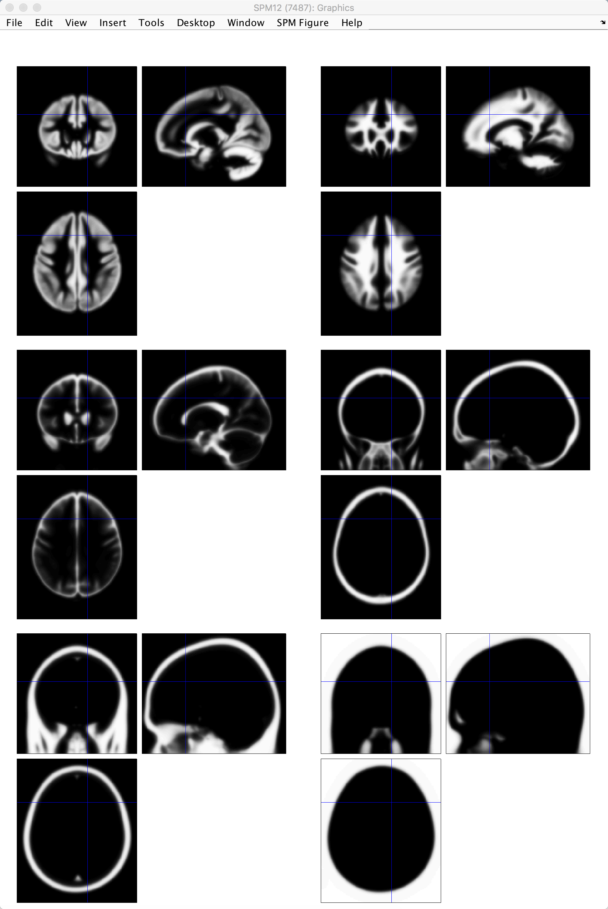
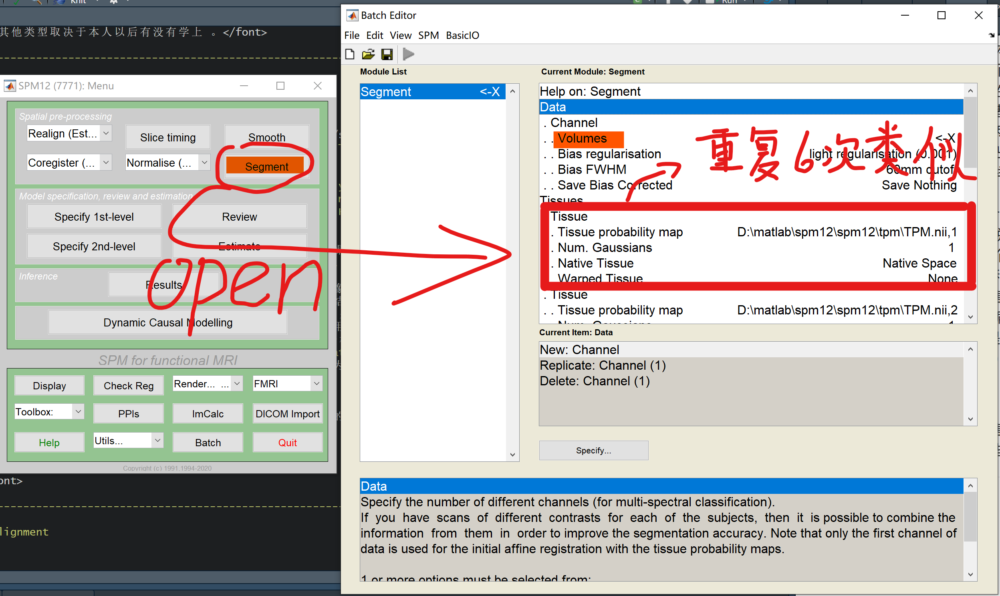
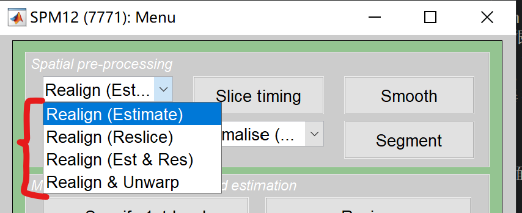
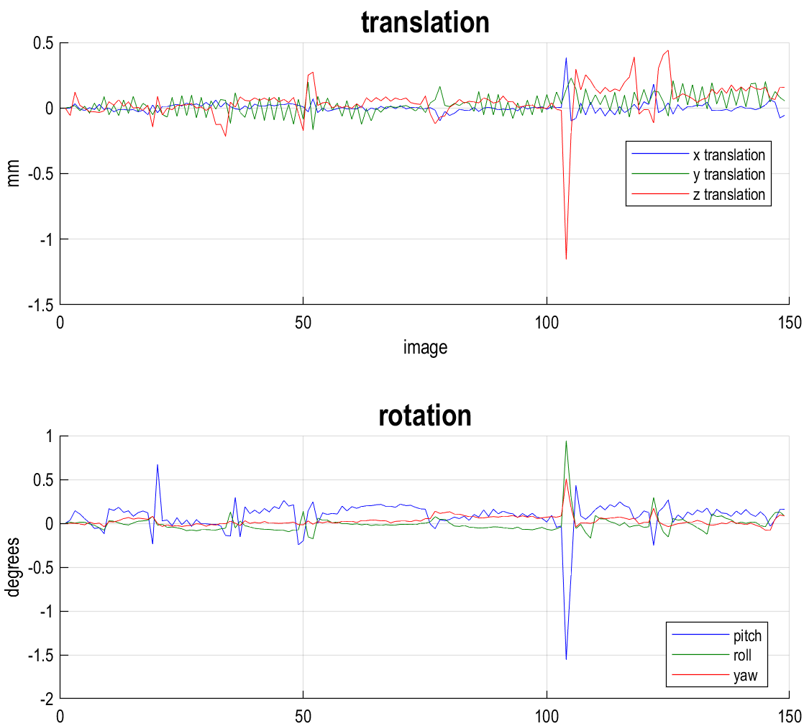
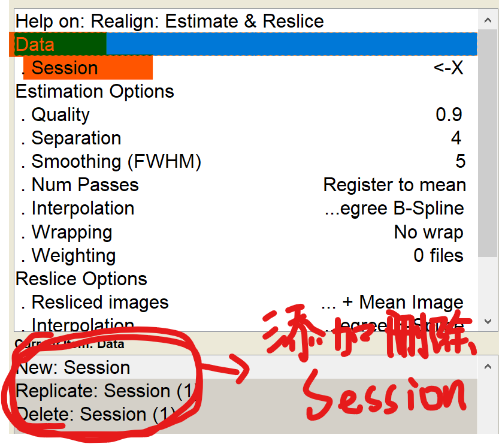
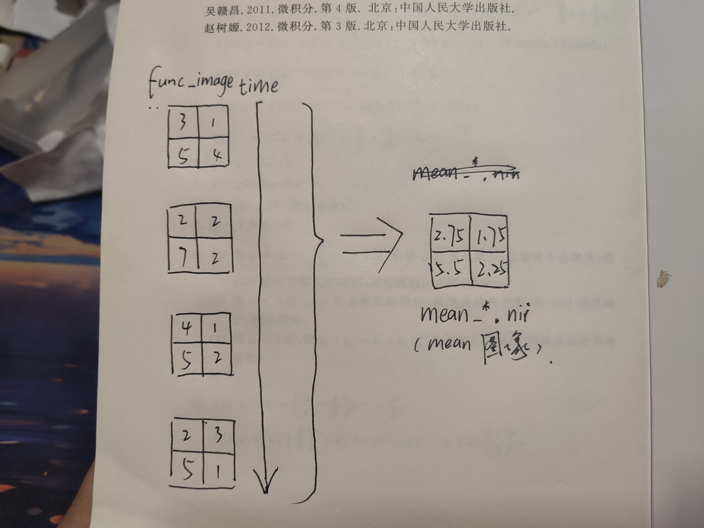
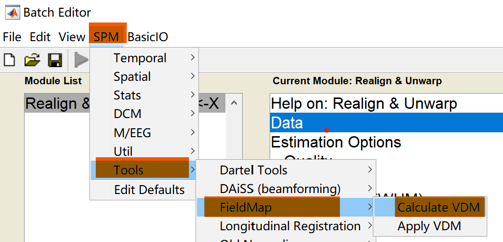
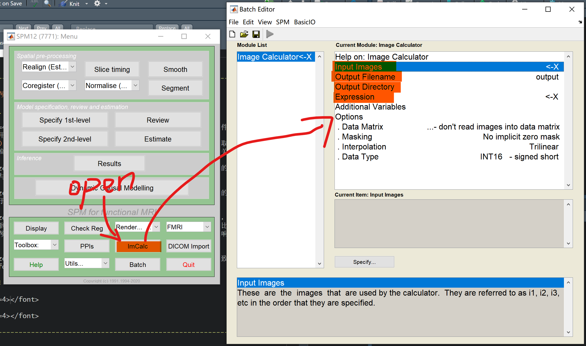

# 导言

 这篇随笔针对许多有兴趣于fMRI但是受限于平台或机会对相关知识操作并不是那么accessible的心理学同窗们，包括我自己在写这篇东西的时候也是边学边写，这里也感谢深圳大学何振宏教授课题组能够让我有接触核磁数据处理的机会。fMRI的预处理包括了许多步骤，这些步骤可以在目录导航看到，此处不多赘述。通俗来说，这玩意有两种类型的图片或者影像：功能像和结构像。有普通心理学基础的各位都对fMRI有印象：让被试做任务或者干个什么事情，他脑子某个区域就激活，而这个激活的图像，就是由功能像图片告诉我们；可是这个激活准确而言是在哪里或者说哪个结构的位置，这就需要结构像为我们提供信息。而预处理打个不准确的比方，就好像用ai修复清代老照片（这个表述有些夸张），让我们本来的图像更加清晰，分析起来更加准确。就像很多新生初次学习SPSS一样，SPSS课程进度往往比心理统计快，所以容易造成初学者不知道自己操作的意义是什么，本篇随笔就是针对背景薄弱的同窗们学习SPM操作时，能够有个东西提示我们每个操作最基本的意义是什么，甚至每个必要参数的基本的意义是什么。 

 本人知道，在目前信息发达的时代，很多人写的东西要比这篇随笔更强，但是在我学习有关概念的时候，我发现很多博客或者视频只是教授各位如何去操作，而很少涉及为什么要这样操作。我相信翻开这篇随笔的各位应该不满足于自己不知其所以然的样子。因此我决定将网络或各个来源的碎片化知识在这里进行一个粗糙的整合，若是能够发挥一丝作用，本人实属荣幸。本版本仅先针对事件相关设计的核磁处理（event-related design）其他类型取决于本人以后有没有学上 。

------------------------------------------------------------------------

# 4 **图像分割（Segmentation）**

## 操作意义

### 基本思想

 据一本很权威的[参考书](https://shop.elsevier.com/books/statistical-parametric-mapping-the-analysis-of-functional-brain-images/penny/978-0-12-372560-8 "Statistical Parametric Mapping: The Analysis of Functional Brain Images")，之所以我们需要对图片进行分割操作是因为：

> Segmentation refers to separating your data into different tissue types. Segmentation in SPM is done based on probability maps of six tissues: grey matter, white matter, cerebrospinal fluid, non-brain soft tissues, skull, and other (representing anything not captured by the previous maps). Knowing which voxels in your image belong to which tissue type can improve **normalisation**.

 相信以上的的说明非常简明扼要地解释了分割图像是什么以及操作的基本思路，即依据已有的“分割蓝图（即组织概率图，这个在后续会讲）”将原本一体的T1加权功能性图像分割到六种组织成分（灰质、白质、脑脊髓液、脑内其他软组织、颅骨以及其他成分）。

 但是这些内容仍然没有确切地告诉我们相比于直接用功能性图像，分割图像具体好在那几点上。这里本人根据自己的理解并参考查阅到的一些资料尝试做一些说明。首先故名思意，分割图像就是将我们本来的结构图像分为了几个重要的部分（把原有图像的无数体素按灰质白质脑液等成分来“分组），而这样做在空间配准中可以提高准确性，打个比方，如果我们有组装模型或者玩过变形金刚的经历，我们发现，当两块零件需要对接在一起的时候，定位凹槽越多则零件结合地越准越牢靠，同样的采用分割图像后，相比于原始图像，我们可以更好地对齐脑区边界，在normalize（这个操作后面章节会详细说）时将不同个体的脑图像调整到同一个标准空间中，以便进行跨个体的比较和分析。其次，根据[这篇研究](https://ieeexplore.ieee.org/document/6091984 "Simultaneous segmentation and inhomogeneity correction in magnetic resonance images")，图像分割还能够改善磁场不均匀所带来的体素偏移，那么这也能够为之后Normalize提供改善（减少了图像的走形嘛毕竟）。

### **组织概率图（Tissues Probability Map）**

 在之前的描述中，我们已经说了一些原则性的思想。不过这里本人认为有必要介绍一下**组织概率图（Tissues Probability Map）**的概念。这个玩意是基于标准空间中的先验知识的**组织概率图**，提供了每个体素属于特定组织类型的概率。这句话需要我们展开去理解，组织概率图就像是大脑的地图集。它们是根据很多人的大脑扫描图像制作的，显示了大脑中不同组织通常在哪里出现的概率。就像地图集可以帮助你在现实世界中导航一样，组织概率图可以帮助软件在处理你的大脑图像时，更好地识别和分类不同的组织类型。之所以这样说是因为当我们说这些概率图是“先验”的，意思是它们是基于之前收集的信息制作的，而不是从你当前的大脑图像直接得出的。

 spm默认的组织概率图（见图4-1）为其自带的`TPM.nii`文件，该文件所包含的六个frame可以分别对应图中的不同脑结构部分。我们用于分析的T1加权功能像正是被这张图“告知”：某某体素多多大概率上属于某某结构。而后该图像在程序执行中将不同体素按着这位“向导”的概率建议下将无数体素按其所应属分组。

## 实务操作

### 参数笔记

 以上我们简单说完了图像分割的意义，下面我们进行实际操作的一些说明。在spm中，我们可以很轻易地打开Segmentation的batch文件（如图4-2）。而在这个batch菜单中需要说明的参数可能就比较多了。这里我所记下的参数知识仅仅包括了一般操作中需要修改的参数。不过受限于我自己的水平，这一块写得确实有些地方很不清晰，如果有高人愿意指正（跪求），万分感谢。

{width="430"}

#### **Data类别的参数**

 Volume参数：这个参数就是我们输入需要被分割的T1加权结构像，没啥难理解的

 Save Bias Corrected参数：需要Save nothing改为Save bias corrected，作用是保存经过偏差校正的图像。偏差校正是一个预处理步骤，用于纠正磁共振成像（MRI）数据中由于不均匀的磁场强度导致的信号强度变化。这种变化可能会影响组织的**对比度和亮度**，从而影响分析的准确性。这个过程会生成一个新的`ms_*.nii`文件（有点像针对功能像的Realignment里的Unwarp功能）这个文件修正了原始扫描中的那些不均匀的亮度问题。这样的图像可以在后续的归一化（Normalize）发挥作用，使Normalize结果更为准确可靠。

#### **Tissues类别的参数**

 Tissues Trobability Map参数：输入组织概念图，这里默认是`TPM.nii`文件，前文已有说明，此处不多赘述。

 Native Tissue参数：用于指定如何保存分割后的组织类别图像。选择不同的参数水平会影响这些图像的保存方式和格式，进而影响后续的数据处理步骤。下面是各个选项的意义和效果：

| 选项                     | 效果                                                                                                                                                | 生成新文件                                                       |
|------------------------|------------------------|------------------------|
| None                     | 不保存任何组织类别图像                                                                                                                              | 无                                                               |
| Native Space             | 保存与原始扫描空间对应的组织类别图像，这在后续的区域特定分析中使用                                                                                  | `c_*.nii` 如`灰质c1_*.nii`、`白质c2_*.nii`、`脑髓液c3_*.nii`     |
| Dartel Improted          | 调整个体组织类型图片使之统一到一个标准空间里（非MNI空间而是一个群体特定的模板），能够使之后配准和归一化更为准确，也能为后续**平滑（Smooth）**做准备 | `rc_*.nii` 如`灰质rc1_*.nii`、`白质rc2_*.nii`、`脑髓液rc3_*.nii` |
| Native + Dartel Imported | 就是前面俩效果加起来                                                                                                                                | 略                                                               |

注：在何教授的分割中，我们对重点的白质灰质脑髓液Tissues都是选择Native+Dartel，剩余的只是Native

 Warped Tissue参数：该参数据我能够查到的资料在功能描述上与前文Dartel Imported非常相似：将分割后的组织类别图像（如灰质、白质）变形到标准空间。但是也有提到Warped Tissue参数在标准SPM分割步骤中用于将分割的组织图像变形到标准空间，而Dartel imported参数则是在DARTEL流程中使用，用于处理已经预处理的图像，以便进行更精细的群体配准和分析。两者的应用场景和流程不同。不过目前的我还不是很清楚明白。望今后能够简单清楚地将这部分完成吧，也欢迎或者说渴求高人指正教导。Warped Tissue有不同选项如下：

|选项|效果|生成新文件|
|-----|-----|-----|
|none|不进行任何调整，不生成新的体积变化校正文件|无|
|Modulated|生成调整后的图像，这意味着在映射到模板空间时，考虑了个体脑组织的体积变化。这对于体积测量（如VBM分析）很重要|`mwc_*.nii`|
|Unmodulated|生成未调整的图像，即使映射到模板空间，也不考虑体积变化，通常用于功能分析|`wc_*.nii`|

注：在何教授的分割中，我们对白质灰质脑髓液Tissues都是选择Unmodulated，剩余的只是None

#### **Warping & MRF类别的参数**

 Affine Regularisation参数：这个较真地说就很高端，但是直接看到选项就能直观理解一些里面有欧洲模板、东亚模板以及平均模板什么的，这就看起来通俗一些了。当选则选的无脑操作先。等以后不会就问。

 Deformation Fields（变形场）参数：成前缀变形场文件`y_*.nii`或`iy_*.nii`。这个文件包含了将分割后的脑组织图像（如灰质、白质）从个体空间标准化到模板空间（上一个参数说的什么欧洲模板东亚模板的）所需的坐标变换信息。这对于后续的分析步骤非常重要，如Voxel-Based Morphometry（体素基态形态测量）或功能性磁共振成像分析。该参数又以下选择：

|选项|功能|生成文件|
|-----|-----|-----|
|Forward|告诉SPM生成一个包含由原图映射到模板所需空间位置变换信息（变形场）的文件，以便在后续的分析中使用，特别是在进行标准化（Normalization）时非常重要|`y_*.nii`|
|Inverse|生成从标准模板空间映射回个体脑部图像空间的逆变形场文件，可帮助我们后续将群体分析的结果映射回个体空间或将模板中的兴趣区域（ROI）映射到个体空间|`iy_*.nii`|

注：在何教授的Normalize中，我们对Deformation Fields参数都是引用了分割中Forward所生成的`y_*.nii`。

### 具体操作

 这里的具体操作其实在各位理解了基本思想与参数后再参照何教授的培训视频就可以很好地学习了，同样考虑到一些同窗没有接触到培训，我也录制了一个[演示的视频](https://www.bilibili.com/video/BV1Ff421Q788/ "欢迎指正")

------------------------------------------------------------------------

# 5 **头动校正 Realignment**

## 操作意义

 这个操作就很好理解，而且还能学会三个地道表达的新单词：yaw、row、pitch，很6。因为fMRI扫描一次脑就需要几秒的时间，而单单扫描几次全脑根本达不到科学统计的最低样本要求，因而这就造成了fMRI实验过程很漫长，相比于行为实验一个trial的时间可能就几秒，fMRI的一个trial可能奔着十秒以上去了。同样的试次，行为实验可能被试已经事了拂衣去，fMRI的被试还可能在机子里煎熬，并且有些机构还得换衣服。这就形成了一个问题：长时间保持颈椎一动不动是一件痛苦的事情，这也是本人的鞠老师说过这玩意大小伙子来当被试正好的原因。因而为了图像质量，我们不得不抛弃任意维度头动超过3cm的被试，在此基础上对剩下的被试进行位置的矫正。

### 与AC-PC对齐的差异

 不过说到头动，很多人想必会和我一样有个困惑，这个步骤的意义听起来和前面的AC-PC对齐有一些相似之处，一下子有些混淆。其实两个步骤之间仍然是存在着一些的区别的：

|          | 头动校正                                                   | AC-PC对齐                                              |
|------------------------|------------------------|------------------------|
| 操作对象 | 主要是功能像                                               | 主要是T1结构像                                         |
| 操作意义 | 将时间序列中多个由于头动发生位移的功能像按其内部参考点对齐 | 将单个T1结构像与外部某“模板头”对齐                     |
| 操作效果 | 使得时间序列中的每个体素位置保持一致                       | 将个体的大脑图像对齐到一个标准的空间，以便于比较和定位 |
| 操作方式 | 可使用btach批处理                                          | 手动one by one或半自动                                 |

 这时候需要再补充一句，头动校正就好像是一个小学生列队内部一二一把动作统一；AC-PC对齐则是结构像对着电视里模特走秀学走路。

### 补课指路牌

虽然头动校正背后的意义听起来很简单，但是在实际中，其实有挺多参数还是需要再话时间理解的，比如在[刘梦醒博士的此视频讲解](https://www.bilibili.com/video/BV1nb4y1R7k1 "SPM系列教程-03：头动校正 Realign")中便与何教授不同，单个nii可能包含了多个**frame**、或者几个**Session**的文件可以在一起处理等。你看，上面我说的俩新名词就是之前在《spm fMRI 初学者笔记 #1》里转格式那一章的笔记内容（建议各位回去翻一下）。我们在进行指定路径并选中文件的时候便需要考虑到这些因素的变化。

## 实务操作

### 个人对参数的理解

 在SPM12中，头动校正功能就在界面的左上排头第一个的位置（如图5-1），这里展开之后我们可以看到不同的功能选择，它们的功能差异可以参考newbing提供的回答：

>  想象一下，你有一堆拼图块，你需要把它们拼成一幅完整的画面。这些拼图块就像你的fMRI图像，而拼成的画面就是你想要分析的大脑活动的完整视图。
>
> 如果你只是想要检查每个拼图块是否有瑕疵（比如头动），你可能会选择**Estimate**。这就像是检查每个拼图块，确保它们都是完好无损的，但你还没有开始拼图。
>
> 如果你已经知道哪些拼图块有问题，并且你想要修复它们，那么你会选择**Reslice**。这就像是用胶水把破损的拼图块修复好，让它们可以完美地拼在一起。
>
> 如果你既想检查拼图块，又想修复它们，那么你会选择**Estimate & Reslice**。这就是最常见的情况，你一边检查拼图块，一边修复它们，确保最后能拼出完整的画面。
>
> 最后，如果你的拼图块因为某些原因（比如磁场不均匀性）变形了，你需要特别的工具来修正它们，这时你会选择**Realign & Unwarp**。这就像是使用一个特殊的工具来把变形的拼图块恢复原状，以便它们能够准确地拼在一起。

 相信以上的说明是足够通俗的，在这个基础上，我们可以再进行比较正式的说明补充。**Estimate**选项用于估计图像之间的运动参数。它不会创建新的校正后的图像，只会生成参数文件（见图5-2），这个ps后缀文件会被程序存在原始数据所在的文件夹，另外还会生成一个`rp_*.txt`文件也记录相关参数。在Estimate的结果基础上，我们可以首先通过头动幅度是否过大来判单该被试是不是可以剔除，这个标准是空间移动每个维度在3cm以内、不同层面头部转动不超过3 degree。

{width="450"}

 **Reslice**这个选项则用于根据之前估计的运动参数来调整图像，使其与参考图像对齐。这适用于当你已经有了运动参数并且想要创建校正后的图像。这里本人一开始觉得鸡肋，因为如果没有estimate的头动参数，Reslice就做不了，所以就很迷为什么这个reslice还单独成一个选项。但其实不然，这样设置确实给个程序灵活性。比如在一个大型的数据处理流程中的早期阶段我们已经估计了运动参数，这些运动参数可能使用于几个Session，然后在流程的后续步骤中，我们可能需要重新应用这些参数来校正其他类型的图像，或者对同一组图像进行不同的分析。这时，Reslice就派上用场了，因为它可以自动去寻找你之前估计好的参数文件`rp_*.txt`，而不必每次都重新运行Estimate步骤，节省时间和算力。

 **Realign & Unwarp**则适用于我们同时需要校正头部运动和磁场不均匀造成的伪影。想要理解这个参数，我们则先需要理解**磁场不均匀校正**这个概念，这个步骤非常重要，因为如果磁场不均匀，那么同样的激活程度，A处磁场更强而B处磁场稍弱的情况下，图像上的某些部分可能会看起来比其他部分更亮或更暗，实际上强度一样的激活会看起来A处比B处更活跃。这会影响我们对大脑活动的解读。所以，磁场不均匀性校正帮助我们确保图像质量，让我们能够更准确地分析大脑功能。虽然这里选项上没有写，其实Realign & Unwarp包含了Estimate，也会首先计算头动参数，再自动依据`rp_*.txt`文件进行校正。同时，Realign & unwarp还需要我们提前进行**计算体素位移图（Calculate VDM）**，体素位移计算结果作为Realign & unwarp的运行参考数据，这个道理和数据与 Reslice需要头动参数差不多。

|          | Reslice                            | Realign & Unwarp                                 |
|------------------------|------------------------|------------------------|
| 操作对象 | 单纯由于被试物理运动造成的图像位移 | 由于机器可能存在的磁场不均匀造成的图像扭曲、伪影 |
| 所需素材 | 被试头动参数                       | 头动参数&体素位移图                              |

**计算体素位移图（Calculate VDM）**是理论上我们进行Realign & Unwarp的必要条件。Calculate VDM是场图校正过程的一个重要步骤。体素位移图（VDM）是一种特殊的图像，它记录了由于磁场不均匀性导致的每个体素位置的变化。通俗地说，VDM就像是一张地图，上面标记了每个体素因为磁场问题而需要移动到的新位置。那么同理，我们要修正磁场不均，就需要按照这张图反向操作。

### 具体的操作

 尽管头动校正有着那么多的功能选择，但是根据我对于网络诸多教程的观察，绝大多数人一般而言会选择进行Estimate & Reslice操作。我像这主要是考虑到了这个参数能够涵盖最基本的校正操作，同时具备代表性。而何教授采用了的Reslice & Unwarp应该是考虑到了其自身的研究需求和方法特殊性。但是为什么计算体素位移和头动校正这俩步骤为啥不挨着我确是目前还没有参悟明白。

{width="300"}

 这里如果我们按照主流操作，通过Estimate & Reslice进行头动校正。其实步骤的简单程度和dicom转格式一样。我们只是需要将目标Session对应的所有图片输入，然后傻傻地等待结果就行,这里双击Data =\> Session就可放入需要处理的数据，如果需要增加新的Session，可以参考图5-3。**注：头动校正结果输出`r_*.nii`文件**。

{width="340"}

另外需要说明的是，头动校正后spm还会生成一张**mean图像**，即一个`mean_*.nii`文件。该mean图像是将不同时间下各个功能像区域的体素信号强度进行平均得到的一个，具有代表性的功能像图片。可以参照图5-4来理解，在图中假设每个大方块是脑影像的部分区域，小方块是一个体素，其上的数字代表该体素的信号强度（当然是数字越大信号越强），而mean图像则是头动校正后，对不同时间序列的体素们**取平均信号强度**。该图像能够发挥以下作用。

-    质量控制：平均图像可以帮助我们检查头动校正的质量。我们可以在头动校正完成之后display平均图片，如果头动校正做得好，那么平均图像应该是清晰的，没有模糊或者重影。这样检查可以确保图像质量。

-    功能和结构对齐：在下一步进行空间配准时，平均图像是我们将功能数据（fMRI）和结构数据（如T1加权图像）的配准所能够使用的参考图像，平均图像常常被用作功能数据的代表，因为它比单一时间点的图像更加稳定和清晰。

-    参考标准：在下一步的空间配准中，当我们将个体脑影像与标准空间配准时，它提供了一个稳定的参考，可以用来进一步的图像处理。

-    提高信噪比：这一点有点像事件相关电位的平均话操作，在对各个体素进行信号强度平均的同时，将多张图片叠加在一起，减少了偶然的噪声（就像是杂乱的背景），而真正的信号（就像是照片的主题）会因为在每张照片中都存在而变得更加明显。当我们查看平均图像时，真正的脑活动信号就会比背景噪声更加清晰。

 相信各位还留意到，图5-3中下部还有许许多多的细节参数，并且好奇这些参数的意义是什么。我固然也想知道，但是考虑这篇笔记的主要目的仍是面向初学者的认知手脚架，再者本人的精力实属有限，因而无奈难以面面俱到。至于这些参数是否需要修改各位倒也不必担心，这些默认参数都是开发人员经过多次调试而保留的最为稳妥的参数水平，再者，如果之后的任务里有特殊需求，何教授想必也会再做安排，到那时候想必各位已经有了一定基础，这些知识就慢慢积累吧

 在何教授的方法中，**计算体素位移图（Calculate VDM）**这个步骤虽然是Realign & Unwarp理论上的必要素材，但是需要我们手动额外插入新步骤（见图5-5）,但遗憾的是，这部分内容本人仅仅了解皮毛，这里同窗们可以去选择阅读[此篇博客](https://www.jianshu.com/p/dc4f108114ee "核磁干货|SPM场图校正")来学习更多细节的参数。

------------------------------------------------------------------------

# 6 **去除颅骨头头皮**

## 操作意义

 首先我在互联网上找到的资料大部分是使用**CAT-12**插件进行的，不过何教授这里则使用了SPM本身的**图形计算器（Image Calculator）**。不过我觉得前者操作会更为简单。这一步骤被称为脑提取或颅骨剥离，其目的是为了提高后续分析的准确性和可靠性。以下是去除颅骨和头皮的几个关键原因：

-  提高配准精度：去除非脑组织可以减少图像配准过程中的干扰，从而提高将个体脑图像与标准脑模板对齐的精度。

-  减少信号噪声：颅骨和头皮等非脑组织可能会引入额外的信号噪声，去除这些组织有助于减少噪声，提高信号的信噪比。

-  统一分析标准：在群体水平上比较不同个体的脑活动时，需要将所有个体的数据标准化到一个共同的空间。这里再回到拼图的那个比喻中，我们需要比较很多脑的拼图差异，而去除颅骨头皮就好像去除我们拼图块的多余非核心部分，否则会影响到我们的比较。

-  避免后续分析错误：如果非脑组织未被去除，可能会导致后续的统计分析出现偏差。

## 实务操作

 首先这里我们可以从spm界面点击图形计算器打开相应的batch（如图6-1）。之后我们可以先设置好去除颅骨后的图像名字以及这个结果储存在哪个文件路径位置。

 而在图6-1中，输入图像则是刚刚Segmentation中我们保留的**与原始扫描空间对应的组织类别图像**（`c_*.nii`文件）和**Bias Corrected图像**（`ms_*.nii文件`）

 而**Expression**参数根据何教授培训，可以输入公式`i1.* ((i2 + i3 +i4) > 0.5)`。之后运行程序，我们便可以在刚刚设置的输出路径中得到我们的去除颅骨头皮的T1加权结构性图像。

------------------------------------------------------------------------

# 笔者邮箱

 [程诚柏然](mailto:harmuorwork@.com "harmuor@qq.com 欢迎交流")

推荐阅读：

<>

<https://www.fil.ion.ucl.ac.uk/spm/docs/tutorials/>

<https://andysbrainbook.readthedocs.io/en/latest/SPM/SPM_Overview.html>
