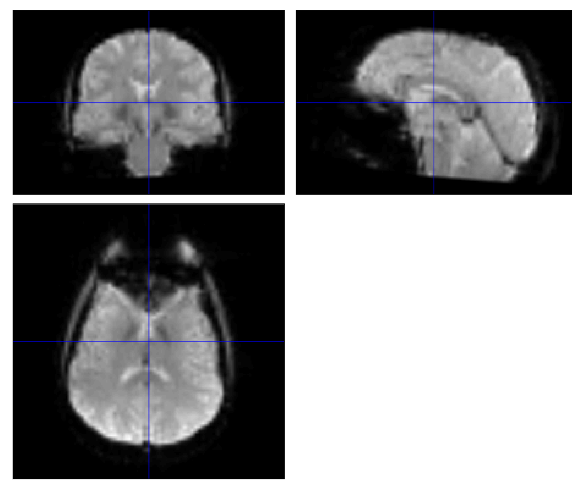
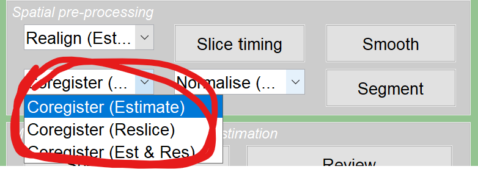
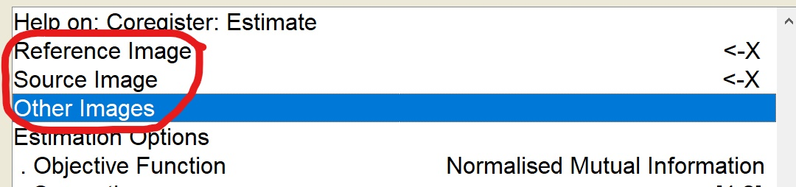
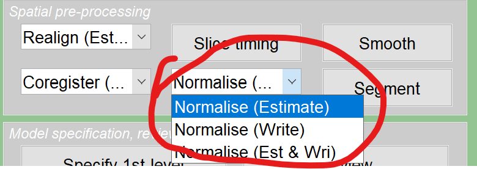
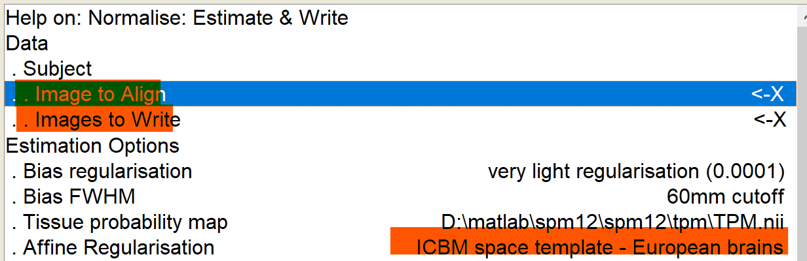
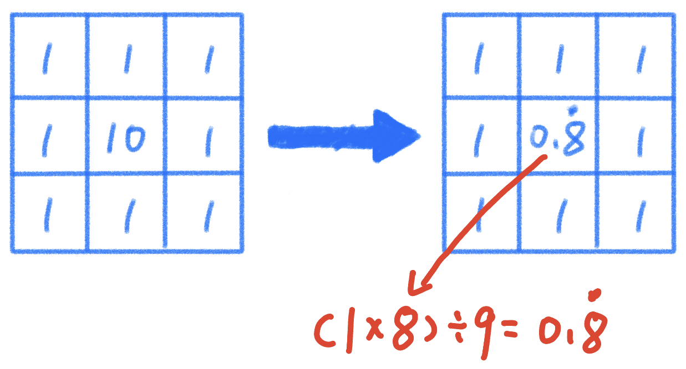
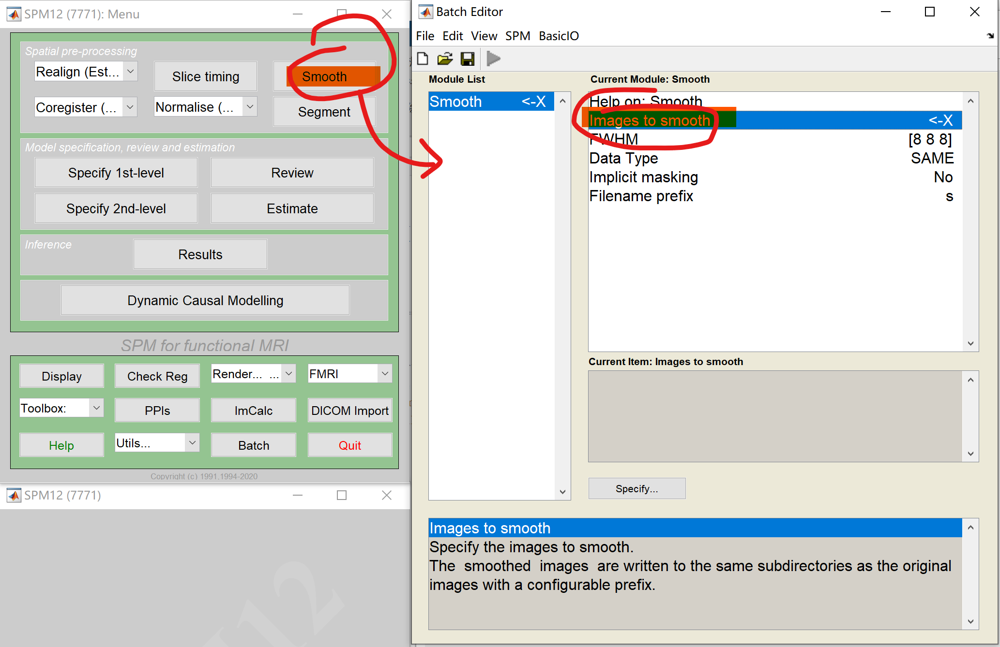

# 导言

 这篇随笔针对许多有兴趣于fMRI但是受限于平台或机会对相关知识操作并不是那么accessible的心理学同窗们，包括我自己在写这篇东西的时候也是边学边写，这里也感谢深圳大学何振宏教授课题组能够让我有接触核磁数据处理的机会。fMRI的预处理包括了许多步骤，这些步骤可以在目录导航看到，此处不多赘述。通俗来说，这玩意有两种类型的图片或者影像：功能像和结构像。有普通心理学基础的各位都对fMRI有印象：让被试做任务或者干个什么事情，他脑子某个区域就激活，而这个激活的图像，就是由功能像图片告诉我们；可是这个激活准确而言是在哪里或者说哪个结构的位置，这就需要结构像为我们提供信息。而预处理打个不准确的比方，就好像用ai修复清代老照片（这个表述有些夸张），让我们本来的图像更加清晰，分析起来更加准确。就像很多新生初次学习SPSS一样，SPSS课程进度往往比心理统计快，所以容易造成初学者不知道自己操作的意义是什么，本篇随笔就是针对背景薄弱的同窗们学习SPM操作时，能够有个东西提示我们每个操作最基本的意义是什么，甚至每个必要参数的基本的意义是什么。 

 本人知道，在目前信息发达的时代，很多人写的东西要比这篇随笔更强，但是在我学习有关概念的时候，我发现很多博客或者视频只是教授各位如何去操作，而很少涉及为什么要这样操作。我相信翻开这篇随笔的各位应该不满足于自己不知其所以然的样子。因此我决定将网络或各个来源的碎片化知识在这里进行一个粗糙的整合，若是能够发挥一丝作用，本人实属荣幸。本版本仅先针对事件相关设计的核磁处理（event-related design）其他类型取决于本人以后有没有学上。

------------------------------------------------------------------------

# 7 **空间配准（Coregister & Normalize）**

## 操作意义

### 基本思想

在之前的部分，我们对功能像和结构像分别进行了不同的处理。当然针对功能像的操作比较多。尽管如此，当我们再去观察功能像的投影时（如图7-1），我们发现虽然我们可以看到功能像将激活区域与非激活区域做出了区分，可（1）这些区域准确对应了脑的哪些结构呢（图像太模糊了）？另外，（2）我们怎么能确定该被试这些激活和其他被试的在空间上具有可比性呢（也许这些参数换个脑袋会位移到其他位置）？

 因而针对以上两个问题，我们能够使用的解决方案便是**空间配准（Coregister）**。这一个操作的逻辑就是，虽然你功能像能展示出我们感兴趣的脑区激活但分辨率低，但是他结构像分辨率不是很高吗？只要我们能够将结构像与功能像之间对齐、配准，那么在个体层面上，我们就能够足够清楚地观察到底是那个脑区或结构产生了激活了（有点像PS里的图层叠加）。其次，还有一个问题是即使我们将一个被试看得再清楚，可是大部分时候实验都是分组处理的。这就可能导致被试甲和被试乙由于躺的姿势不一样、头枕的位置不一样，这俩人脑影像的坐标也不近相同。那按这个道理，人数再多一些，组间比较在空间层面就基本没啥可行性了，毕竟如果在一张图片里大家的脑子位置都不一样，图层一叠起来还不够晃眼的。如此，我们就需要将所有个体的脑和一个**标准空间配准(Normalize)**（这里还有个学名“**归一化处理**”），在这个空间中大家的脑子都能在大致同一个地方，当我说：“我的处理组在标准空间坐标（4，5，6）有激活”，但是同行们用自己的对照组一比较：标准空间（4，5，6）处的脑区没有激活，我们就知道：“噢，我的处理发挥了作用。”通过将个体脑影像准配到标准空间，使来自不同被试的脑图像可以在同一空间标准下进行比较和分析、不同的研究之间便有了可比较性、同时提高了我们的分析精度。一般而言现在用的比较多的标准空间是MNI空间，就是“蒙特利尔神经病学研究所”空间。

### 不同的顺序取向

 虽然我们已经明白了空间配准的基本思路就是把“功能像-结构像-标准空间”这样的三个事物在空间上绑在一起。但是，打个比方，加入我在练习绳艺时需要将折腿缚和后手缚套在模特身上，不管是先绑手还是先绑腿，最后效果看似大差不差。可是在核磁数据这种高精尖分析中，顺序的不同带来的差别可就大了，因而如何选择配准顺序，最终取决于我们具体的研究目的。不过目前有个原则就是结构像能不去动就不要动他。每一次对结构像的处理都会造成结构像的数值改变甚至是失真，那么如此，假如有些图片是参照修改之前的结构像进行处理的，这样就会有个前后统一性的问题，也就是说，结构像的稳定性受到了影响。

## 实务操作

 由于空间配准被分为了Register和Normalize两个部分，因而为了笔记方便也会这样安排。同时这里我们选择的操作步骤为Coregister =\> Normalize。作为范例。

### **Coregister**

如图7-2，Coregister类似头动校正，也分成了不同的功能选择。这里类似于头动那里，Estimate就是不改动数据而仅给出误差参数；Reslice就是自动根据Estimate生成的参数文件来对图像进行校正对吧。但是这里也有不同的地方，因为空间配准其实是涉及到了两个步骤，如果你反正在之后Normalize处理中都会对图像进行改写，那么Coregister中就没有必要再改写一次数据了，纯浪费时间和算力。因而仅于Coregister步骤中给出Normalized修正数据文件所需的素材（**变换参数文件**）即可。

 在选择好Coregister的Estimate功能后，我们就需要理解输入的参数了。这里必须要输入的参数有**reference image**、**source image**以及**other image**三个（如图7-3）。这里面的逻辑关系就是，参考图像是不会被改写数据的参照点、源图像则是需要根据参照点进行调整和变动的图像，而其他则是跟随源图像一起调整以确保其二者之间的一致性。打个比方，我们想象一个车队正在向目的地进发，目的地就是参考图像；而领队的车就是这个车队的代表，是源图像；车队里其他的车子就是领队的追随者，需要跟着领队去变化自己的位置，所以他们就是其他图像。在实际出发前，领队规划出的行进线路便是Estimate步骤所产生的**变换参数**。这时候我们再回过头去看这三个参数便清楚明了多了，所以放在我们本例的核磁数据上，则是我们的功能像跟随平均图像（Vol2的第5章有提）向T1结构像接近，在此基础与思路上生成一个用于Normalize的参数文件。不过同样需要注意的时，与头动Estimate相似，不会生成改写后的nii文件，而是会输出一个`rp_*.txt`的变换参数文件。 该文本文件记录了以“领队为代表”的一众功能像与结构像间的空间对应关系，包括平移和旋转的参数，这些参数用于之后将源图像与参考图像对齐。

 在Coregister Estimate选择好输入文件后，当然，这里参考图像我们同样可以输入的不仅仅可以是普通的结构像，我们之前去除颅骨头皮的结构图像也能够放进去，这一点需要结合我们具体的研究需求。之后如无特殊需求就可以点击run了。和之前头动校正一样，这里除了一些变换参数文件，对功能像并不会进行特别大的改写产生新的图像文件。所以我们只需要继续下一步即可

### **Normalize**

 在之前Coregister操作中，我们得到了一张从功能像到功能像空间的“配准导航图”（变换参数文件），而这之后便是通过Normalize将结构像和标准空间配准，而后诸多功能像会随着那张导航图跟进结构像的。如此，我们完成了功能像—结构像-标准空间的配准。

打开spm后，如图7-4，Normalize也分为了几种功能，不过总体效果我们可以参照之前在头动与Coregister说过的内容。这里还是要提一嘴就是此处的Estimate输出文件和前面的还是不一样的，这里的参数文件是关于目标图像（本例中是结构像）对标准空间的移动参数。因而加之我们需要在这一部分对所有图像进行实际的调整和改写，这里我们应该选择的操作就是Estimate & Write。当然，也有研究者比如我们的何振宏教授在此处并没有设定计算Normalize的Estimate，这里的原因我想未来还需要请教组里的老哥。

 将Normalize功能打开后（如图7-5），我们则需要调整的参数有**Image to Align、Image to Write**以及**Affine Regularisation**。其中Affine Regularisation就是可以设置我们参考的标准是欧洲脑还是亚洲脑什么的（如果不选择Normalize Estimate就似乎没有这个参数），这个比较好理解，这里重点说一下前俩参数。

-    Image to Align是指用于对齐标准空间的的图像（此例中为结构像），这个图像会被用来估计变换参数，这些参数随后可以被应用到其他图像上，以便将它们对齐到相同的标准空间。

-    Image to Write则是选择那些你想要应用变换参数的图像（此例中是功能像），它们会根据 Image to Align 估计出的参数被写入（或者说是转换）到标准空间。

 当然，和之前Coregister中一样，我们用于对齐的功能性图像也可以是Segment（如果做了这一步的话）还可以是结构图像的分割结果（Segment：Forward Deformation文件，具体来说是做完分割后的一个`y_*.nii`文件）。空间配准结束后，**生成`w_*.nii`的功能像文件**。

------------------------------------------------------------------------

# 8 **空间平滑（Smooth）**

## 操作意义

### 步骤思路

 总结放在最前面：这个步骤说白了就是给图像做个高斯模糊。首先我们都知道，一张nii文件中存在无数个体素，这些体素的bold信号反映了该区域脑结构的激活状态。但是学习过信号检测论的各位知道，在现实信号捕获中，我们所观测到的信号未必都是真实的物质变化，在fMRI扫描中亦是如此：每个体素的信号采集结果有可能是真实的血样水平变化；也有可能仅仅是因为机器失误所造成的伪影。

 虽然机器会不可避免地产生伪影，但是如果我们用一台被学术界同行认可的核磁机子去扫描被试，那么我们可以肯定图像脸上的“饭粒”是很小一部分的体素，因此它至少能够保证自己观测到的绝大多数体素的bold信号确实是靠谱的（不然也太艹了）。而Smooth则正是依据这个数量关系特点来优化图像的。

 这里我们先举一个有关笔者照片美颜的故事。在曾经的一个夏天，笔者春心萌动而想要把自己的自拍发在推特上。然而，彼时由于疯狂熬夜，本人无暇的脸上多出了一个与其他区域眼色格格不如的一颗小色块——饭粒。可是很明显，本人真实的长相其实是没有那个临时的饭粒的，所以那个饭粒属于降低我图像质量的噪点。因此，为了提高本人朋友圈图像的质量与准确性，我们需要对照片进行磨皮操作，把那颗饭粒“磨掉”。而这些，正是Smooth所进行的操作。

 这里我们可以进行一个简单的类比，假如在图8-1中，我们这几个方块是几个相邻的体素，其中的数字代表着我们观测到的该体素上的bold信号强度，数字越大，信号强度越大。这里我们发现，明明其他体素的bold信号不高，可独独中间那个看起来高得离谱（就好像我们好端端的面皮上有一个颜色非常突兀的黑菜渣）。这个时候，我们可能会认为，那个体素的信号是异常的（类似于离群值极端值）。而图8-1右边的经过处理后（当然这个某种处理在实际中会应用于图像上其他的体素），我们通过某些方法把这个被认为是异常的信号的峰值抹平一些（平滑），这一步虽然会让我们的图像变得模糊（p图不也是会让照片的部分质感变得不真实嘛），但是这样，总体看来我们至少得到了一个异常值没有那么多的图像。这样在fMRI图像分析中是有利于提高图像信噪比和研究可靠性的。同时能够减少个体之间的差异、让我们能够专注于研究主要关注的区域。

## 实务操作

 这一个步骤其实相较于之前的空间配准而言其实还是比较简单的。在图8-2中，我们可以看到Smooth的batch中的参数也少于其他的几个batch，基本就是把要进行处理的图像输入进去就可以了。在和教授的操作中，我们就是将之前空间配准好的文件投喂进去。不过依照惯例，还是说几个参数可能对后续学习比较好。

{width="450"}

### 个人对几个参数的理解

这里除去设置输入文件和输出文件前缀，我只会尽力对其余的几个进行记录。

#### **FWHM（Full-Width Half Max）**

 这个参数定义了平滑的宽度。具体来说，FWHM是指平滑核在其最大值一半时的宽度。在图像处理中，较大的FWHM会导致更强的平滑效果，可以减少噪声，但同时也可能模糊掉一些细节。通常，FWHM的单位是毫米，常用的值如8mm。打个比方，这就像是你用一个特别的橡皮擦，它可以擦掉照片上的噪点和不清楚的地方。FWHM就是告诉软件，橡皮擦应该有多大。如果橡皮擦很大，它就会擦掉很多细节；如果很小，它就只能擦掉一点点。使用默认吧兄弟，这里水很深你把握不住。

#### **Data Type**

 这个参数决定了输出图像的数据类型。不同的数据类型可以存储不同范围和精度的数值。例如，UINT8是无符号8位整数（这个也是我R语言常用的编码方式欸），范围是0到255；而FLOAT32是32位浮点数，可以存储更大范围和更精确的数值。选择合适的数据类型可以在保证精度的同时减少文件大小。使用默认吧兄弟，这里水很深你把握不住。

#### **Implicit Masking**

学过格式塔我们知道一张图像有图形和背景之分，放在nii里也一样。这个选项就是告诉程序是否在Smooth中忽略对背景部分的处理。比如像素值为0的地方（还有其他别的数值特征）让程序当成背景不要放入Smooth的处理过程中。这样可以增加信噪比，避免背景噪声被引入我们感兴趣的图形区域（如果图8-1的九宫格里一格是背景，那再当图形一部分去处理就有时候不大妥当）。

 说了以上那么多，其实这些参数并不是每次需要我们去调整的，即使是何教授的预处理batch也未必会改变默认参数水平。这里仅仅是我整理一下做额外了解。其实我们仅仅将上一步处理好的功能像文件输入进入，就可以得到处理后结果了。**`s_*.nii`文件**。

------------------------------------------------------------------------

# 笔者邮箱

 [程诚柏然](mailto:harmuorwork@.com "harmuor@qq.com 欢迎交流")

推荐阅读：

<https://www.fil.ion.ucl.ac.uk/spm/docs/tutorials/>

<https://andysbrainbook.readthedocs.io/en/latest/SPM/SPM_Overview.html>
